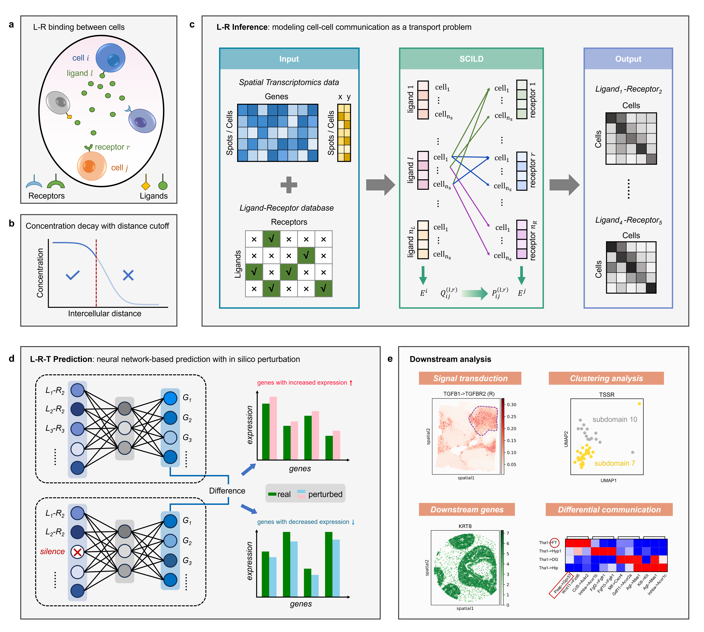

------------------------------------------------------------------------------------------------------
# SCILD: Advancing spatial cellular communication inference in spatial transcriptomics

## Authors
- yujiating@amss.ac.cn
- lywu@amss.ac.cn

## Pipeline
- SCILD (Spatial Cellular communication Inference with Ligand Diffusion and transport model) is an interpretable computational framework for inferring spatial CCC from ST data. 
- SCILD conceptualizes ligand diffusion and receptor binding as a cargo transport system with potential losses during the transport process.

<p align="center">
  <a href="https://github.com/jiatingyu-amss/SCILD/">
    
  </a>
</p>
<br />

## Algorithm
- SCILD introduces a sophisticated high-dimensional tensor optimization problem to quantify cellular communication strength while considering competitive interactions. 
-  We employed mathematical techniques, such as sparse tensor vectorization and Lagrangian duality, to develop efficient algorithms for solving the optimization problem addressed by SCILD.

<p align="center">
  <a href="https://github.com/jiatingyu-amss/SCILD/">
    
  </a>
</p>
<br />

## Installation

We recommend to create a new environment with Python 3.10:
```sh
conda create -n py310 python=3.10
conda activate py310
```
The `SCILD` package can be installed via:

```sh
git clone https://github.com/jiatingyu-amss/SCILD.git
cd SCILD
pip3 install -r requirements.txt 
```
<br />


## Usage

Please checkout the tutorials at
[here](https://github.com/jiatingyu-amss/SCILD/blob/master/Vignettes/Test_Layer456.ipynb).

### 1. Preparing your ST data in h5ad format
You can downloaded an example data from [here](https://github.com/jiatingyu-amss/SCILD/tree/master/Example_data/).
```sh
import scanpy as sc
```
```sh
adata = sc.read_h5ad('./Example_data/PDAC_processed_clean.h5ad') 
```

### 2. Preparing L-R database in data frame format
It is recommended to download [the CellChatDB database ](http://www.cellchat.org/) or [the CellPhoneDB database ](https://www.cellphonedb.org/), and then convert it to the dataframe format we need.\
Or, you can download the database with the help of the `commot` python package, using the help function `create_LRDatabase_D` provided by us.
```sh
from Models.Help_func import create_LRDatabase_D
```
```sh
LRDatabase_D = create_LRDatabase_D(
    adata,
    min_cell_pct=0.01,
    database='CellChat',
    species='human'
)
```

### 3. Running SCILD

```sh
from Models.SCILD_main import *
```
```sh
CCCProb = SCILD(adata=adata,
                LRDatabase_D=LRDatabase_D,
                neighbor_k=5,
                niter_max=100,
                eps=1e-4,
                verbose=True,
                plot_error=True
                )
```
```sh
CCCProb.preparing()
nl = CCCProb.nl
nr = CCCProb.nr
ns = CCCProb.ns
print('The number of ligand is: ' + str(nl))
print('The number of receptor is: ' + str(nr))
print('The number of spot is: ' + str(ns))
```
```sh
mu0 = np.random.random(nl * ns).reshape(-1, 1)
v0 = np.random.random(nr * ns).reshape(-1, 1)
CCCProb.solving_optimization(mu0, v0)
```

### 4. parameter descriptions
 parameter name | description                                          | type           | default 
 :------------- | :--------------------------------------------------- | :------------- | :------ 
 adata          | input ST data (contains expression matrices and spatial spot information)   | h5ad           | None    
 LRDatabase_D | A ligand-receptor interaction database | data frame | None 
 neighbor_k | Parameter used to define the cutoff distance as d_cutoff=k*d_min, where d_min is the minimum inter-cell distance | int | 5 
 alpha_q | Coefficient for the non-negative penalty term in the optimization objective function | float | 0.1 
 alpha_f | Coefficient for the relaxation term of the ligand emission signal constraint in the optimization objective function  | float | 0.1 
 alpha_g | Coefficient for the relaxation term of the receptor reception signal constraint in the optimization objective function | float | 0.1 
 niter_max | Maximum number of iterations for solving the optimization problem | int | 100
 eps | Iteration termination error for solving the optimization problem | float | 1e-5
 verbose | Flag to print the process details during execution| bool | False
 plot_error| Flag to plot the error during the iterative solving process  | bool | False

<br />
